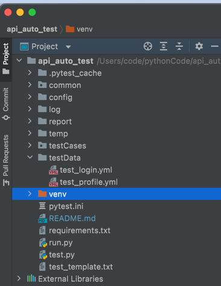
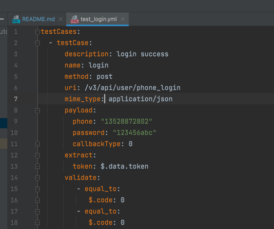
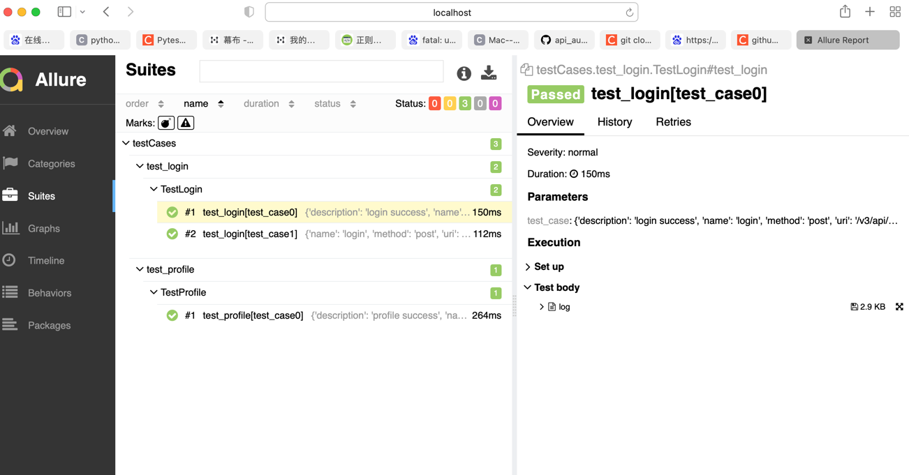

# api_auto_test
pytest+request+yaml+allure完成数据驱动的接口自动测试框架

一、工程目录结构

common: 工具包，主要是封装了request，yaml文件读取等

config：存放配置文件

log：日志文件目录

report：allure报告目录

temp：allure临时文件

testCases：pytest脚本目录

testData: 存放yaml测试数据

run.py 执行测试用例的入口

框架使用：

在testData目录下，编写yml文件，yaml文件格式，文件名以test_开头

内容格式如下：

提取值时，以jsonpath方式进行提取，引用时，通过${token}方式进行引用
断言时，也是通过jsonpath方式进行提取作为key，预期值作为值

二、执行测试用例及生成allure测试报告

进入工程目录执行命令 python run.py 生成pytest测试脚本并且执行

通过命令  allure generate ./temp -o ./report --clean 生成allure报告

在report目录查看allure报告

报告展示如下：

后续计划

1.丰富断言方式，xpath，整个json断言

2.增加数据校验

3.增加自定义测试用例执行顺序等
